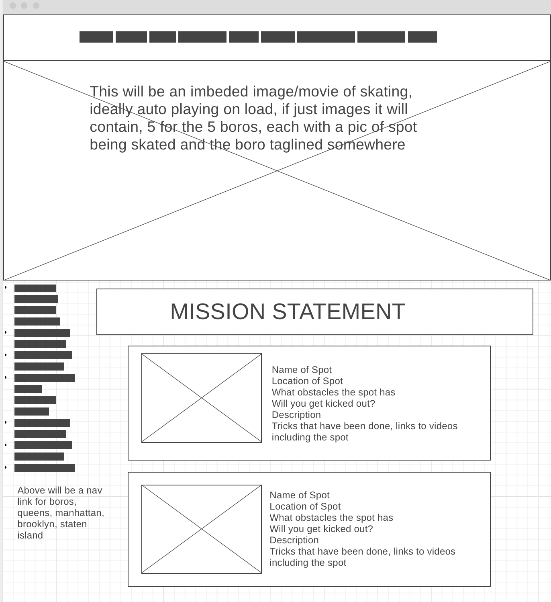
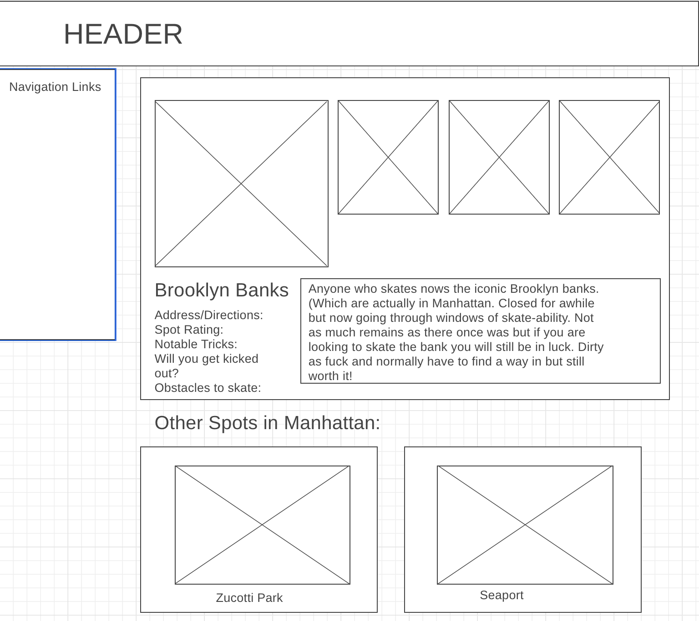
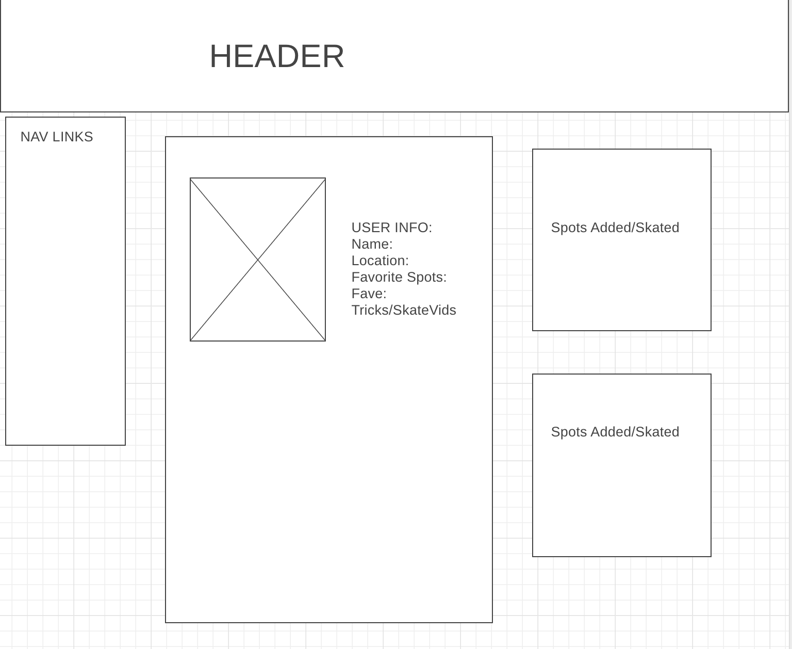
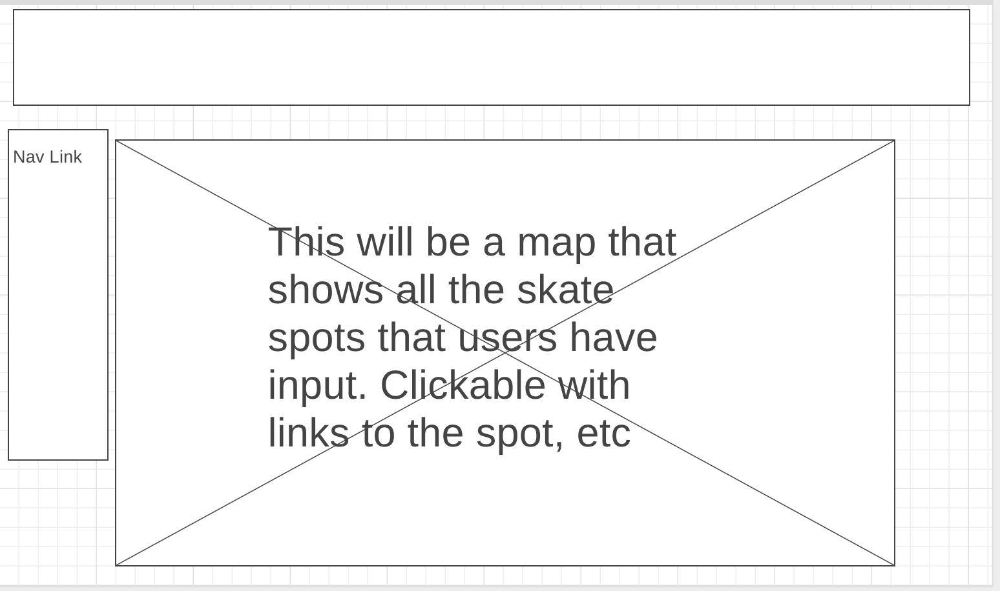
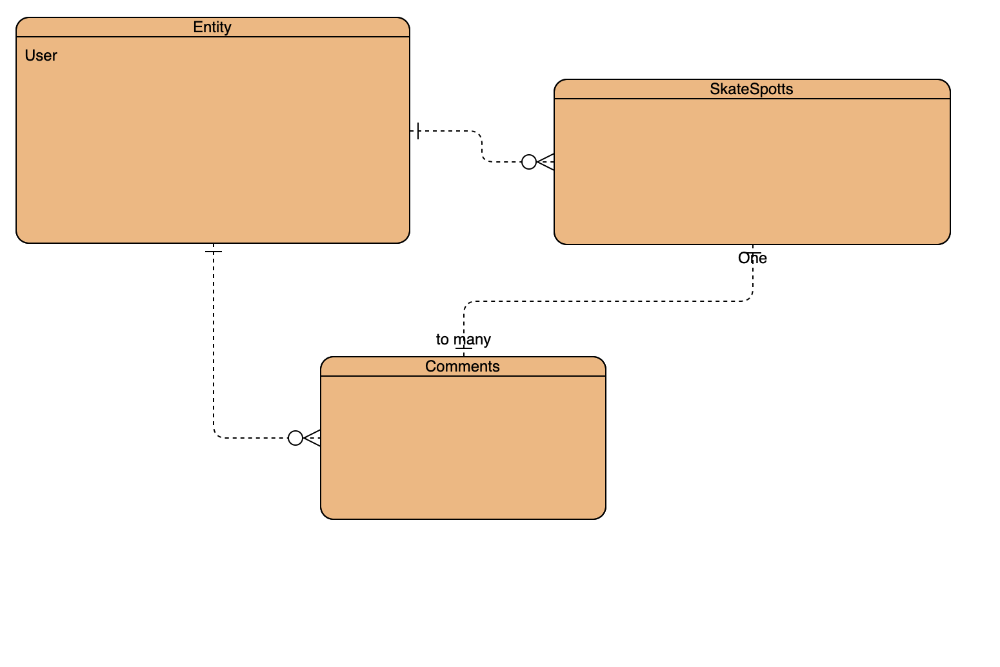

Title: Skate Spot Finder

Overview: An application that allows users to pinpoint skate spots on a map. The spots are user sourced and will require an address/description, as well as other information, such as obstacles to skate, if you will get kicked out, and a place to list tricks done/maybe links to the tricks. Users can comment on skate spots so that other users can see whether or not the information provided by initial user is accurate, etc. This app I plan on being NYC centric so the locations will be divided up by boro/train stop.

Features: - Create User/Log in
          - Only registered users may upload spots/comment
          - Users can click on individual spots for more information on them
          - Users can comment on spots
          - Spots may be updated by user incase they are no longer vialbe to skate, or the recently become a place you get kicked out of
          - Ideally would like to implement a rating system

Goals: My goal is to have full functionality on this website for the map aspect. 

Challenges: I think the biggest hurdle for me is going to be implementing the map system to actually update when users makes new spots. I am at the moment totally unsure of how to work this into my project easily.

MVP: Create/Log in for users. Post Skate Spots. Post Comments. 

Client: Mid-fi wireframes, component heirarchy, component breakdown, and timeframe estimates.^^

Server: 
Dependencies: React, Link/router, GoogleMapReact
Post-MVP: I would like to implement a feature for users to mark themsevles as "skating here" to let their friends know where they are skating that day, also would like to turn it into an actual social network site in this way. Where people can interact with each other. Also would like to implement a feature that has non skate spots to check out nearby. Mainly just like where to get food in the area or a good bar to stop for a drink.# SkateSpots
